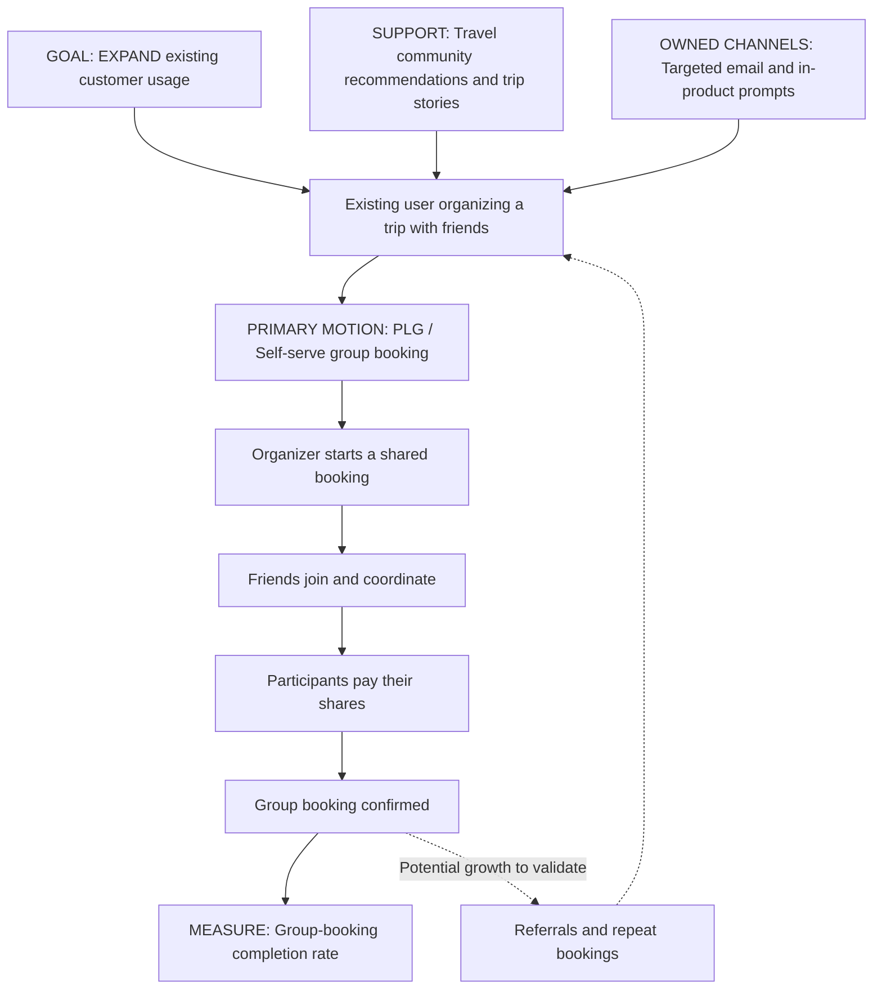

# Roamly Groups — GTM Strategy V1

## Strategy one-pager

**Primary goal — Expand:** Enable existing customers to book group experiences and generate incremental completed bookings. Acquisition of invited friends is a secondary benefit.

**Target segment:** Small groups of friends traveling together, initially organized by existing Roamly users. Their acute pain is coordinating availability, separate bookings, and manual payments. The organizer initiates; participants share the decision and control their own payments.

**Target audience:** Existing users actively organizing a trip with friends, followed by invited participants who need to confirm plans and pay.

**Positioning:** For friends who want to experience a destination together, Roamly Groups combines curated local experiences with coordinated group booking, split payments, and shared itinerary planning, reducing the effort of managing separate bookings and manual coordination.

**Key messages:**
- Book the experience together.
- Pay your own share.
- Keep everyone aligned with one shared itinerary.

**GTM motion:** Product-led growth (PLG) is primary, with travel communities as a supporting layer. The self-serve flow directly addresses coordination friction; invitations may introduce new customers. Community recommendations support discovery and trust, but a repeatable community-led growth mechanism is not yet proven. Sales-led growth is not the initial priority for friend groups.

| Strategic input | Assessment |
| --- | --- |
| Time to value | Initial planning value should appear within minutes; booking completion depends on participant responses and payments. Validate both. |
| Buyer and user | Organizers and paying participants also use the experience; decision-making is shared. |
| Annual contract value | Not directly applicable to transactional bookings. Assess booking value, platform revenue, repeat frequency, and service costs. |
| Sales cycle | Self-serve booking, with human support for exceptions. |
| Scaling mechanism | Invitations, referrals, and repeat group bookings; effectiveness remains to be tested. |

**Channel approach:** Use targeted in-product prompts and email to reach relevant existing users. Provide clear invitation, participation, and payment flows for friends. Test recommendations and trip stories in relevant travel communities; scale channels based on completed bookings rather than traffic alone.

**Pilot:** Begin with a limited set of cities and hosts verified for group capacity. Product, Growth, Host Operations, Support, Payments, and Analytics prepare the launch together. Define payment deadlines, cancellation and refund handling, and host readiness before inviting groups.

**Primary success metric:** Group-booking completion rate = confirmed group bookings / eligible group-booking starts within a predefined completion window. Define eligibility and tracking before launch, and compare against a comparable baseline or control.

**Supporting measures:** Invite-to-payment conversion, incremental platform revenue after refunds and variable costs, and repeat group bookings. Monitor cancellations, support contacts, host fulfillment, and the solo-booking experience. Set numerical targets after establishing baselines.

## Motion infographic

**Motion at a glance:** Community and owned channels support discovery → the product enables coordination and payment → confirmed bookings demonstrate completion → repeat use and referrals may support growth.

## Pressure-test and refinement

**Weakest input:** Treating CLG as proven. Existing community discovery does not establish community-led conversion or retention. Refine the choice to PLG with community support.

**Hidden assumption:** Easier coordination guarantees participant commitment. Budget and scheduling differences may still prevent completion.

**Proposed pushback:** The scenario explicitly identifies manual coordination and payments as barriers for users who want to book together. This supports a focused pilot, not a broad rollout. Keep coordination as the value proposition while testing completed bookings, not just invitations.

**What to sharpen:** Recruit existing users with active group-trip needs, validate the group type, and start with ready hosts. Investigate participant drop-off before expanding.

**Known evidence:** Users coordinate group bookings manually; group sessions have high drop-off; support reports product friction; overall repeat booking is strong.

**Unvalidated assumptions:** Friend groups are the best initial segment; hosts can accommodate them; removing friction creates incremental bookings; invitations acquire new users.

**Next test:** Identify group types and abandonment reasons, then pilot the complete flow with a suitable comparison to assess booking completion and incremental value.
.
- **القياس:** الحجوزات الجماعية المؤكدة مقسومة على محاولات الحجز المؤهلة خلال مدة محددة مسبقًا، مع مقارنة مناسبة. نراقب أيضًا انتقال المدعوين إلى الدفع، والإيراد الإضافي، وتكرار الحجز، والإلغاءات، والدعم، وقدرة المضيفين، وتجربة المسافر الفردي. نضع الأهداف الرقمية بعد معرفة خط الأساس.
- **النقد والرد:** تسهيل التنسيق لا يضمن اتفاق المجموعة، لكنه يعالج عائقًا مذكورًا في السيناريو ويبرر تجربة محدودة. نحتفظ بعرض القيمة ونختبر أثره على الإكمال قبل التوسع.
- **حدود الأدلة:** وجود التعثر معروف، لكن أفضلية الأصدقاء وجاهزية المضيفين وحجم الإيراد الإضافي ونمو الدعوات ما زالت افتراضات.

*V1 working draft — strategy hypotheses, not validated launch results.*
