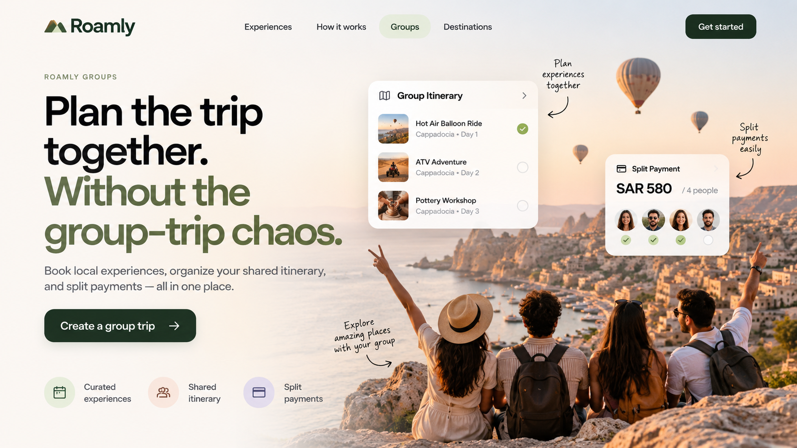

# Messaging Pillars & AI-Generated Asset — Roamly Groups

> Module 4 · Deliver Messaging That Captivates Customers — ★ Deliverable 4
>
> Turn your positioning into a message that moves people: set the market context, build a pillar per audience, activate it across surfaces, and produce one AI-generated asset.

## 1. From/To market shift

| | |
|---|---|
| **From (life before)** | Group trips coordinated across group chats, separate bookings, payment apps, and one organizer chasing everyone. |
| **To (life after)** | A shared group travel experience where everyone can plan, book, and pay together in one place. |

## 2. Audience segmentation

- **Number of audiences that need their own pillar:** 1
- **Justification — why each is distinct enough to need its own message:** Our primary audience is the friend organizing the group trip. This person carries most of the coordination burden, from organizing plans to collecting payments, so the message should focus directly on making their job easier and less stressful.

## 3. Messaging pillars

### Pillar — Audience 1: The group trip organizer

| Layer | Message |
|---|---|
| **🎯 Value prop** | Organize the group trip without carrying all the coordination stress yourself. |
| **🏆 Capabilities** | Group booking, vetted local experiences, shared itinerary planning, and split payments in one place. |
| **📊 Evidence** | The product experience allows the group to coordinate a shared itinerary, book experiences, and track split payments together in one place. |

## 4. Activation across surfaces

| Surface | Copy variation |
|---|---|
| **Homepage headline** | **Plan the trip together. Without the group-trip chaos.** |
| **In-app notification** | **Your group plan is ready. Invite your friends to join, choose experiences, and split the payment together.** |
| **Social post** | **Planning the group trip shouldn't feel like a second job. Plan experiences, organize the itinerary, and split payments together with Roamly Groups.** |

## 5. AI-generated asset

- **Asset type:** Homepage hero visual

- **Prompt used:** Create a modern travel marketplace homepage hero for Roamly Groups using the headline “Plan the trip together. Without the group-trip chaos.” Show a group of friends traveling together and product UI elements that demonstrate a shared group itinerary and split payments. Keep the design clean, modern, warm, and focused on group travel coordination.

- **Output:**

[View the full-size Roamly Groups Homepage Visual](https://github.com/ileena/roamly-gtm-strategy/blob/main/04-messaging/roamly-groups-homepage-visual.png.png)

- **What you edited and why:** I focused the final asset on the strongest homepage message and made the shared itinerary and split-payment capabilities visible so the value proposition could be understood without additional explanation.

## 6. Blind-read result

| Question | What they understood |
|---|---|
| **Who is it built for?** | Friends planning and organizing a group trip together. |
| **What does the product do?** | It helps groups plan experiences, manage a shared itinerary, and split payments in one place. |
| **What makes you trust it?** | The visual shows the actual group itinerary and split-payment experience, making the product benefits feel concrete and believable. |

## Link to full artifact

[View the full Messaging Builder artifact](https://github.com/ileena/roamly-gtm-strategy/blob/main/04-messaging/roamly-m4-messaging-ex2.md)
